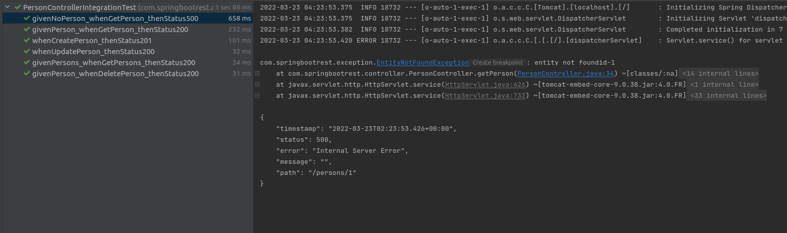
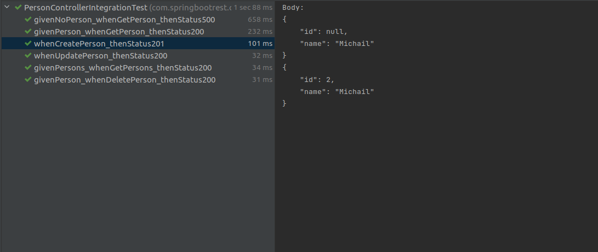
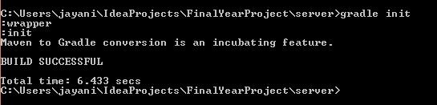

# Тестирование API с REST Assured

**REST Assured** — это Java-библиотека для тестирования REST-сервисов, который встраивается в тесты на Java.

* [Краткое руководство по RestAssured tutorial 2020](https://ru.lambdageeks.com/api-testing-automation-restassured)
* `Tutorial-1`: https://sysout.ru/testirovanie-s-rest-assured
* `Tutorial-2`: https://sysout.ru/spring-boot-rest-api
* `Repo`: https://github.com/myluckagain/sysout/tree/master/spring-boot-restassured






---

* [REST Assured как инструмент тестирования API](https://medium.com/effective-developers/rest-assured-как-инструмент-тестирования-api-216b2d4e2d2c)
* [РУКОВОДСТВО по тестированию REST API с использованием REST Assured](https://www.loadview-testing.com/ru/blog/руководство-по-тестированию-автомат)


---

* [Convert Maven project to Gradle project](https://medium.com/@jayanisumudini/convert-maven-project-to-gradle-project-d1a829d7637f)
  * `Step 1`: I run the gradle init command into project’s root directory containing the **pom.xml**
    ```shell
    gradle init
    ```
    
  * `Step 2`: Remove from project’s root directory containing the **pom.xml**
* [REST Assured Documentation](https://github.com/rest-assured/rest-assured)